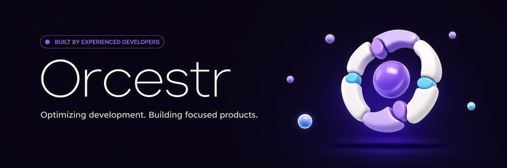

  <strong>English</strong> · <a href="./README.ru.md">Русский</a>

  

# [Orcestr](https://orcestr.com) is open-source

Main website: [orcestr.com](https://orcestr.com)

Orcestr is an ecosystem with open-source libraries, a developer toolkit, applied tools and real products.

The public direction has three parts:

- Open-source **lib**s.
- Open-source **tool**s.
- Web **product**s.

## Ecosystem Projects

| Project | Type | Status | Link | Description |
| --- | --- | --- | --- | --- |
| Orcestr Auth | lib |  | Planned: `orcestr-auth`, `orcestr-fastapi-auth`, `orcestr-next-auth` | Shared authentication layer in three repositories: `orcestr-auth`, `orcestr-fastapi-auth` and `orcestr-next-auth`. It should work with React and Next.js on the frontend, FastAPI + SQLAlchemy on the backend, and cover both regular authentication and OAuth flows. |
| Orcestr Commerce | lib |  | `orcestr-commerce` | Composable commerce core for product catalog records, checkout orders, order items and payment systems, with SQLAlchemy models, explicit module wiring and FastAPI router assembly. The repository is not public yet. |
| Orcestr UI | lib |   | [Artasov/orcestr-ui](https://github.com/Artasov/orcestr-ui) | Reusable UI foundation extracted from real Orcestr product development: components, app shell patterns, workflow primitives and design tokens used in product surfaces. |
| Orcestr Icons | lib |  | Planned | Package with different icon styles and icon sets. It works as an add-on to the main Orcestr UI kit: expanding the product visual language without bloating the base UI library. |
| Orcestr Repo Notifier | tool |  | [Artasov/orcestr-repo-notifier](https://github.com/Artasov/orcestr-repo-notifier) | Turns repository changes into clear Telegram updates so teams, founders and public builders can show product progress after each push without manually writing posts. |
| Orcestr Media Transcriber | tool |   | [Artasov/orcestr-media-transcriber](https://github.com/Artasov/orcestr-media-transcriber) | Repository for transcribing audio and video: a practical foundation for reusable transcripts, media search and future media assistant scenarios. |
| Orcestr Media Assistant | tool |  | Planned | Large assistant for your media space. The first module is a Telegram module for automatic chat conversations; later it can connect transcripts, a media library and content workflows. |
| Beauty | product |  | [beauty.orcestr.com](https://beauty.orcestr.com) | Public AI product for trying on, editing, saving and sharing visual ideas on a real photo, with AI chat, generated looks, history, gallery, presets and credit accounting. |
| Deliveries | product |   | [deliveries.orcestr.com](https://deliveries.orcestr.com) | Operations product for companies that manage products, suppliers, orders, warehouses and payments; a deep surface for testing the shared foundation on real business processes. |

## Contents

- [Ecosystem Projects](#ecosystem-projects)
- [Roadmap](#roadmap)
- [Community token](#community-token)
- [Maintainer](#maintainer)

Some product code will stay closed. Reusable infrastructure should become open when it is stable, understandable and useful outside Orcestr.

## Roadmap

1. Stabilize Beauty beta.
2. Prepare SOL payments for beta testing.
3. `31.07.2026` - Open beta test and prepare free beta-test access for holders.
4. Improve public sharing and gallery conversion.
5. Continue real product surfaces to test the shared foundation.
6. `16.08.2026` - Extract reusable UI primitives into `orcestr-ui`.
7. Bring `orcestr-media-transcriber` into the ecosystem as a foundation for audio/video transcripts and media search.
8. Plan Orcestr Auth as `orcestr-auth`, `orcestr-fastapi-auth` and `orcestr-next-auth` for React, Next.js and FastAPI + SQLAlchemy services.
9. Shape Orcestr Icons as an additional icon package for the main UI kit.
10. Plan Orcestr Media Assistant around media spaces, starting with a Telegram automatic conversation module.
11. Open selected workflow and backend pieces when they are stable enough.
12. Grow the Telegram community through development updates, beta feedback and product discussion.
13. Turn repeated product infrastructure into stable public packages with clear documentation, examples and versioned release flows.
14. Grow Orcestr into a coherent toolkit for building SaaS and commerce products: UI, auth, commerce, media, workflows and operational backends.

## Community Token

ORCESTR is an experimental Community Support Token connected to the Orcestr ecosystem.

It is an optional supporter layer for people following the development early: development updates, beta participation, supporter identity and limited non-financial perks when they make sense.

It is not equity, not revenue share, not company governance and not a promise of profit. The product does not depend on the token.

Possible holder perks may include supporter badges and free beta-test access when we open public testing and the product is ready. Perks are experimental, limited and can change.

See [TOKEN.md](TOKEN.md) for the public token principles.

## Maintainer

Public updates are currently maintained by [@Artasov](https://github.com/Artasov).
