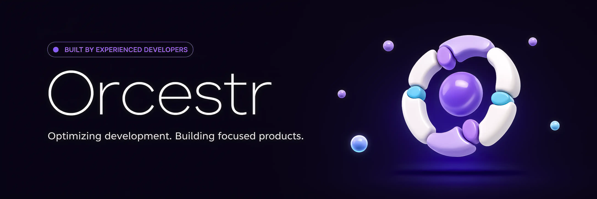

  <a href="./README.md">English</a> · <strong>Русский</strong>

  

# [Orcestr](https://orcestr.com)

Основной сайт: [orcestr.com](https://orcestr.com)

Orcestr - личная продуктовая кодовая база, которая развивается в публичный developer toolkit и open-source библиотеку.

Кодовая база строится вокруг общей продуктовой основы: UI patterns, application shell, identity, permissions, credits,
files, notifications, workflows, статистика и фоновые задачи. Product surfaces используют эту основу в реальных
сценариях, а самые сильные переиспользуемые части со временем могут становиться публичными пакетами.

Публичное направление состоит из двух частей:

- product surfaces, которыми можно пользоваться;
- open-source части, выделенные из production, начиная с Orcestr UI и дальше переходя к workflow, backend и application
  infrastructure.

## Проекты экосистемы

Orcestr - это не один репозиторий, а экосистема продуктов, open-source инструментов и общей платформенной основы.

| Проект | Тип | Ссылка |
| --- | --- | --- |
| Orcestr Platform | Основной сайт и вход в продукт | [orcestr.com](https://orcestr.com) |
| Beauty | AI-продукт для подбора образа | [beauty.orcestr.com](https://beauty.orcestr.com) |
| Deliveries | Операционный продукт для закупок, остатков, заказов и финансов | [deliveries.orcestr.com](https://deliveries.orcestr.com) |
| Orcestr Repo Notifier | GitHub Action для Codex-generated Telegram development updates | [Artasov/orcestr-repo-notifier](https://github.com/Artasov/orcestr-repo-notifier) |
| Orcestr UI | Публичная UI-библиотека из продуктовой разработки | [Artasov/orcestr-ui](https://github.com/Artasov/orcestr-ui) |
| Overview | Публичное описание продукта и экосистемы | [Artasov/orcestr-overview](https://github.com/Artasov/orcestr-overview) |

## Содержание

- [Проекты экосистемы](#проекты-экосистемы)
- [Продуктовое направление](#продуктовое-направление)
- [Product surfaces](#product-surfaces)
    - [Beauty](#beauty)
    - [Deliveries](#deliveries)
    - [Orcestr UI](#orcestr-ui)
    - [Orcestr Repo Notifier](#orcestr-repo-notifier)
    - [Platform foundation](#platform-foundation)
- [Публичные репозитории](#публичные-репозитории)
- [Roadmap](#roadmap)
- [Community token](#community-token)
- [Maintainer](#maintainer)

## Продуктовое направление

Ядро Orcestr - общая основа. Product surfaces нужны, чтобы проверять и улучшать эту основу в реальных workflows.

Цель - делать сфокусированные продукты и не переписывать каждый раз один и тот же операционный слой. Долгосрочное
направление - developer toolkit и open-source библиотека из компонентов, которые прошли реальное продуктовое
использование.

Open source - часть roadmap, а не отдельное маркетинговое обещание. Начинаем с того, что безопаснее и полезнее всего
переиспользовать: UI components, app shell patterns, workflow primitives и design tokens. По мере зрелости основы больше
технических частей можно будет открывать как публичные пакеты.

Часть продуктового кода останется закрытой. Переиспользуемая инфраструктура должна становиться открытой, когда она
стабильна, понятна и полезна вне Orcestr.

## Product surfaces

Product surfaces - не вся история Orcestr. Они показывают, как общая основа ведет себя в реальной продуктовой работе.

### Beauty

Статус: beta.

Beauty - публичный AI-продукт для примерки, редактирования, сохранения и sharing визуальных идей на реальном фото. Уже
есть:

- публичный лендинг и мультиязычная оболочка приложения;
- AI-чат с изображениями и голосовым вводом;
- сгенерированные образы, before/after просмотр и история образов;
- публичные страницы для shared образов;
- галерея образов и style presets;
- ранняя база для optional salon и business workflows;
- учет AI credits и лимиты генерации.

Текущий фокус - beta-качество: стабильная генерация, понятные цены, красивые shared результаты и простой путь от фото к
сохраненному образу.

Навигация:

- AI-чат и generation flow;
- галерея образов;
- мои образы;
- shared look pages;
- style presets;
- settings и consent flow;
- optional business и salon groundwork.

### Deliveries

Статус: большой модуль в активной разработке.

Deliveries - операционный продукт для компаний, которые управляют товарами, поставщиками, заказами, складами и оплатами.
Сейчас кодовая база покрывает:

- каталог товаров, бренды, группы, теги и импорты;
- поставщиков, покупателей и контрагентов;
- заявки на закупку, планы закупок и заказы поставщикам;
- поставки, склады, остатки, партии, резервы и инвентаризации;
- клиентские заказы, возвраты, дефекты и quality flows;
- finance workplace, платежный календарь, FX rates и сверки;
- документы, согласования, задачи, комментарии, уведомления и поиск;
- операционные dashboard, computed flags и risk views.

Deliveries - глубокий product surface для проверки общей основы на реальных многошаговых бизнес-процессах.

Навигация:

- продукты и каталог;
- поставщики, покупатели и контрагенты;
- procurement и purchase orders;
- shipments и in-transit;
- склады, остатки и инвентаризации;
- клиентские заказы, возвраты и дефекты;
- finance, payment calendar и reconciliation;
- задачи, согласования, комментарии и документы;
- operational dashboards и search.

### Orcestr UI

Статус: публичный UI-слой.

[Orcestr UI](https://github.com/Artasov/orcestr-ui) - переиспользуемая UI-основа, выделенная из реальной продуктовой разработки Orcestr. Здесь собираются components, app shell patterns, workflow primitives и design tokens, которые используются в product surfaces.

Теги: UI, components, dashboards, workflows, design tokens, open source.

### Orcestr Repo Notifier

Статус: публичный GitHub Action.

[Orcestr Repo Notifier](https://github.com/Artasov/orcestr-repo-notifier) превращает изменения в репозитории в понятные Telegram-обновления. Он помогает командам, founders и public builders показывать прогресс продукта после каждого push без ручного написания постов.

Теги: Codex, Telegram, GitHub Actions, review, release notes, development updates.

### Platform foundation

Статус: общая основа.

Платформенный слой поддерживает все модули:

- multi-tenant модель доступа;
- права на уровне модулей;
- переиспользуемые workflow-примитивы;
- Taskiq background jobs и scheduler;
- shared WebSocket updates;
- media/document infrastructure;
- AI provider runtime и credit ledger;
- админские инструменты через XLAdmin.

Навигация:

- identity и tenants;
- permissions и module access;
- tasks и approvals;
- notifications и comments;
- documents и exports;
- AI runtime и credits;
- background jobs и scheduler;
- admin tooling.

## Публичные репозитории

Первые публичные части вокруг Orcestr.

- [Orcestr UI](https://github.com/Artasov/orcestr-ui) - переиспользуемые UI-компоненты и продуктовые interface primitives.
- [Orcestr Repo Notifier](https://github.com/Artasov/orcestr-repo-notifier) - GitHub Action для Codex-generated Telegram development updates.
- [Orcestr Overview](https://github.com/Artasov/orcestr-overview) - публичное описание продуктовой экосистемы.

## Roadmap

1. Стабилизировать Beauty beta.
2. Подготовиться к оплате через SOL для бета тестирования.
2. `31.07.2026` - Открыть beta тест и подготовить бесплатный beta-test для holders.
3. Улучшить публичный sharing и conversion из галереи.
4. Продолжать реальные product surfaces для проверки общей основы.
5. `16.08.2026` - Выделить переиспользуемые UI-примитивы в `orcestr-ui`.
6. Открывать выбранные workflow и backend части, когда они достаточно стабильны.
7. Развивать Telegram community через обновления разработки, beta feedback и обсуждение продукта.

## Community Token

ORCESTR - экспериментальный Community Support Token, связанный с экосистемой Orcestr.

Это optional supporter layer для тех, кто рано следит за разработкой: development updates, beta participation, supporter identity и ограниченные нефинансовые perks, когда они уместны.

Это не equity, не revenue share, не управление компанией и не обещание прибыли. Продукт не зависит от токена.

Возможные holder perks могут включать supporter badges и бесплатный beta-test доступ, когда мы откроем публичное тестирование и продукт будет готов. Perks экспериментальные, ограниченные и могут меняться.

См. [TOKEN.ru.md](TOKEN.ru.md) для публичных принципов токена.

## Maintainer

Публичные обновления сейчас ведет [@Artasov](https://github.com/Artasov).
